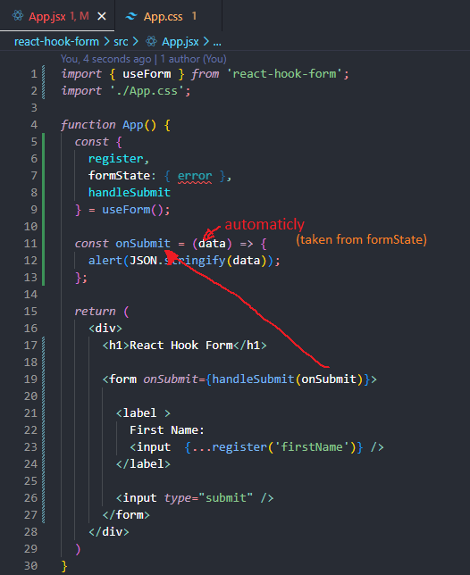

# React Hook Form

1) Register input



Using the spread syntax ({...register('firstName')}) with react-hook-form is necessary because register('firstName') returns an object containing multiple props (onChange, onBlur, name, and ref) that need to be passed to the input element.

Without the spread syntax, you would need to manually assign each property:

```
const { ref, onChange, onBlur, name } = register('firstName');

<input ref={ref} onChange={onChange} onBlur={onBlur} name={name} />
```

Using {...register('firstName')} simplifies this process, automatically applying all required properties to the input.

