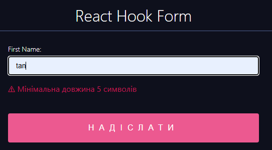
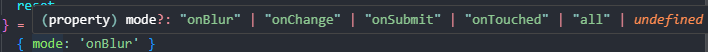

# React Hook Form

## 1) Register input


Using the spread syntax ({...register('firstName')}) with react-hook-form is necessary because register('firstName') returns an object containing multiple props (onChange, onBlur, name, and ref) that need to be passed to the input element.

Without the spread syntax, you would need to manually assign each property:

```jsx
const { ref, onChange, onBlur, name } = register('firstName');

<input ref={ref} onChange={onChange} onBlur={onBlur} name={name} />
```

Using {...register('firstName')} simplifies this process, automatically applying all required properties to the input.

## 2) input validation

```jsx
<label >
          First Name:
          {/* register your input into the hook by invoking the "register" function */}
          <input
            {...register('firstName', {
              required: 'Поле обовязкове',
              minLength: {
                value: 5, message: 'Мінімальна довжина 5 символів'
              }
            })} />
        </label>

        <div style={{ height: '20px', color: 'red' }}>
          {errors?.firstName && <p>{errors?.firstName?.message || 'Error!'}</p>}
        </div>
```



## 3) Reset Form After submitting

```jsx
const {
    ...
    reset
  } = useForm();

  const onSubmit = (data) => {
    ...
    reset();
  };
  ```

## 4) Mode option

```jsx
const {
    register,
    formState: { errors },
    handleSubmit,
    reset
  } = useForm(
    { mode: 'onBlur' }
  );
  ```

  

  In react-hook-form, the mode option defines when the validation and re-rendering occur for form fields. The available modes are:

#### 1. onSubmit (default)
Validation happens only when the user submits the form.
- Fields do not show validation errors while typing.
- Best for performance, but users might not get immediate feedback.

```jsx
useForm({ mode: 'onSubmit' });
```

Example:

- The user types in an invalid email.
- They click the submit button.
- The form checks validation and shows errors if any.

#### 2. onBlur
- Validation occurs when the input loses focus (i.e., when the user clicks away).
- Good for checking inputs after the user has finished typing.

```jsx
useForm({ mode: 'onBlur' });
```

Example:

- The user types an invalid email but sees no error yet.
- They click outside the field.
- The form shows the validation error.

#### 3. onChange
- Validation occurs immediately as the user types.
- Provides real-time feedback but may cause performance issues in large forms.

```jsx
useForm({ mode: 'onChange' });
```

Example:

- The user starts typing an email.
- If the format is incorrect, an error appears while typing.

#### 4. onTouched
- Validation happens when the input has been touched once and then modified.
- Similar to onBlur, but only triggers after the user interacts with the field.

```jsx
useForm({ mode: 'onTouched' });
```

Example:

- The user clicks inside an input and then clicks outside (no validation yet).
- If they type something and then leave the field, validation happens.

#### 5. all
- Validation happens on both onBlur and onChange.
- Provides immediate feedback while typing and when the field loses focus.

```jsx
useForm({ mode: 'all' });
```

Example:

- The user starts typing (sees errors immediately).
- They click outside (triggers another validation check).

### Which mode should you use?

✅ onSubmit → Best for performance, recommended for simple forms.

✅ onBlur → Good for less intrusive validation.

✅ onChange → Best for real-time feedback but can impact performance.

✅ onTouched → Balanced approach; useful when fields shouldn't show errors immediately.

✅ all → Most responsive but can be resource-heavy.
